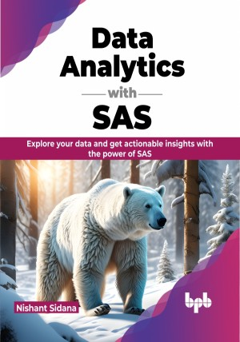

# Data Analytics with SAS

Analytics made easy with Base and Advance SAS

This is the repository for [Data Analytics with SAS
](https://bpbonline.com/products/building-end-to-end-apps-with-c-11-and-net-8?variant=43034073170120),published by BPB Publications.

## About the Book
Data Analytics with SAS is an attempt to learn concepts of Data Analytics with SAS tool. Starting with the fundamentals, the book introduces you to SAS by explaining its architecture, components, libraries and graphical user interface. It then delves into abilities like manipulating and exploring data, where both basic and advanced techniques are covered.

The book outlines concepts and functions for data manipulation. Data manipulation is important as without it, we cannot define data in a proper format. Moreover, data without a proper format and features cannot be used for further analysis.

The book outlines concepts and functions of data exploration. Data exploration or Exploratory Data Analysis (EDA) is the first step in data analysis. It is a very critical step as it helps us get insights from data to understand past behaviors. To facilitate a practical learning experience with SAS, the book offers examples and code snippets.

In conclusion, this comprehensive guidebook serves as a valuable resource for individuals interested in data analytics using SAS. It caters to both novices and seasoned users alike while preparing them for roles, within the field of Data Analytics.

## What You Will Learn
• Get familiar with the functions for insightful data exploration.

•  Shape and transform data using data manipulation functions.

•  Improve efficiency of SAS Operations by combining power of SQL with SAS.

•  Learn how to automate data analysis tasks and share insights across your team with SAS macros.

•  Learn how to visualize your data with impact using a variety of data visualization functions.

